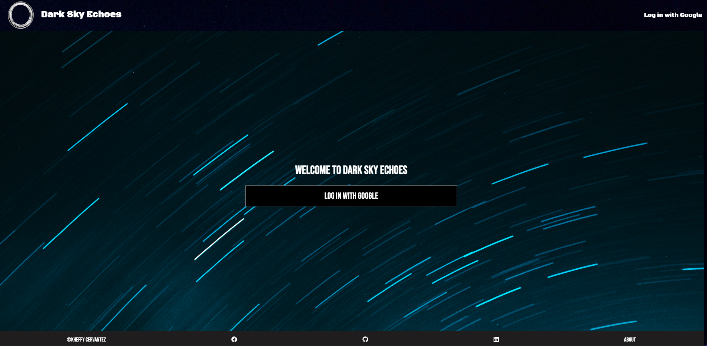
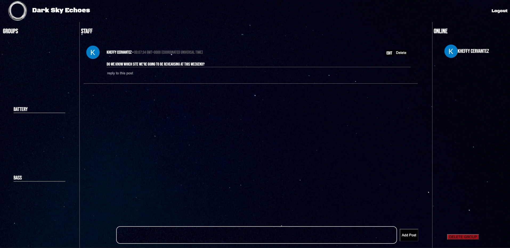

# Dark Sky Echoes

    

    

Dark Sky Echoes is a group page designed off of the ideas of Discord/Slack. It is an easy way to communicate, and reply with those that are authenticated and logged into the website. 
***
## Description
The user is presented with an option to log in with Google OAuth where they will be taken to an index of groups already created. 

If you would like to create a new group, simply choose **+New Group** and you will be directed to a new page for group creation. 

Post, reply, and edit any of your own posts! 

***
## Getting Started
Click on the link below to get started: 

https://dsechoes.onrender.com

***
## Technologies Used

| Technology    | Description      |  |
| ------------- |:-------------:| -----:|
| HTML5     | HyperText Markup Language |  |
| CSS3      | Cascading Style Sheets      |  |
| JavaScript | High Level, Dynamic, Interpreted Language      |  |
| MongoDB | NoSQL document database   |  |
| Mongoose | Object Data Modeling Library (ODM) for MongoDB      |  |
| Express.js | Node.js web application framework     |  |
| Node.js |   Backend JS runtime environment    |  |
| Passport.js | Authentication middleware used for Google OAuth     |  |
| FontAwesome | Footer Link Icons      |  |

***
## Features 
Dark Sky Echoes is centered around the user. Easy accessibility to groups and ease of editing allows each user to feel in control of what they are posting. 

- **Accessibility** - With the side panels and navigation bar, youll be able to access and move around to different groups with ease and accessibility. Anywhere you want to go, you can go from the group page you are currently on. 

-  **OAuth Security** - Feel at ease knowing that all groups are protected and require users to log in before accessing. With Google OAuth Login, your username and avatar are displayed directly onto the website too! 

- **Protected Posts/Comments** - The most important feature about Dark Sky Echoes. Only **YOU** can update, and remove any posts that you create. 

***
## General Assembly
This is Project 2 of my Software Engineering Immersive Program at General Assembly. 

The main focus of this project was CRUD (create, read, update, and delete) operations. 

## Contact
Please reach out if you have questions or would like to collaborate in the future!

kheffy.cervantez@gmail.com

https://github.com/KheffyC
